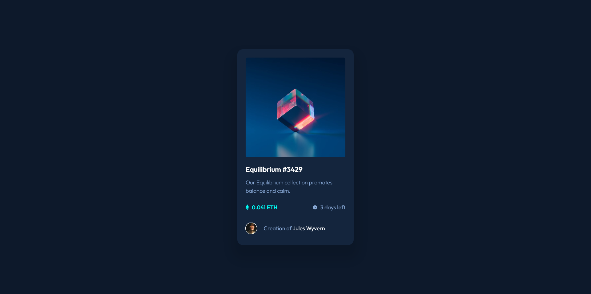

# Frontend Mentor - NFT preview card component solution

This is a solution to the [NFT preview card component challenge on Frontend Mentor](https://www.frontendmentor.io/challenges/nft-preview-card-component-SbdUL_w0U). Frontend Mentor challenges help you improve your coding skills by building realistic projects.

## Table of contents

- [Frontend Mentor - NFT preview card component solution](#frontend-mentor---nft-preview-card-component-solution)
  - [Table of contents](#table-of-contents)
  - [Overview](#overview)
    - [The challenge](#the-challenge)
    - [Screenshot](#screenshot)
    - [Links](#links)
  - [My process](#my-process)
    - [Built with](#built-with)
    - [Continued development](#continued-development)
    - [Useful resources](#useful-resources)
  - [Author](#author)

## Overview

### The challenge

Users should be able to:

- View the optimal layout depending on their device's screen size
- See hover states for interactive elements

### Screenshot

### Links

- Solution URL: <https://www.frontendmentor.io/solutions/nft-preview-card-using-tailwind-css-A0pdz0TOf>
- Live Site URL: <https://peaceful-hamilton-6d6589.netlify.app/>

## My process

### Built with

- Semantic HTML5 markup
- Flexbox
- Mobile-first workflow
- Tailwind CSS

### Continued development

I liked tailwind CSS and want to get better at it and continue using it.

### Useful resources

- [CSS Utility Classes and "Separation of Concerns"](https://adamwathan.me/css-utility-classes-and-separation-of-concerns/) - This artical helped me understand the pros and cons of "Separation of Concerns"
- [When to use @extend; when to use a mixin in a CSS preprocessor](https://csswizardry.com/2014/11/when-to-use-extend-when-to-use-a-mixin/) - This artical helped me understand when to use @extend and when to use @mixin.

## Author

- Frontend Mentor - [@ArthurWiliams](https://www.frontendmentor.io/profile/ArthurWiliams)
- Email - [arthurwiliams86@gmail.com](mailto:arthurwiliams86@gmail.com)
